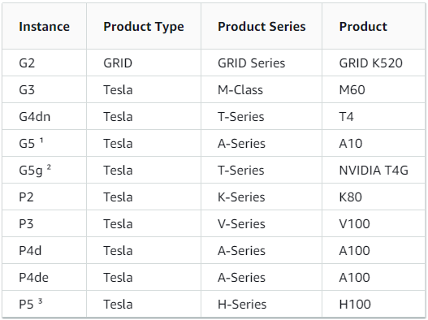

# Pixel Streaming on AWS (Linux)


## Important Notes:
This guide is made specifically for Unreal Engine 4.27 and will not work if you’re using any earlier versions.

If you're interested in running an AWS Windows instance, please see the [Pixel Streaming on AWS (Windows)](Pixel%20Streaming%20on%20AWS%20(Windows).md) guide! 

Please check the [FAQ](../FAQ.md) for extra information.

## Initial Requirements:
Working with this guide assumes you have the following:

- An active account with Amazon Web Services (AWS)
- A packaged, pixel streaming ready application

For more information on this, please familiarize yourself with the following documents:

- Getting Started with Pixel Streaming:
https://docs.unrealengine.com/4.27/en-US/SharingAndReleasing/PixelStreaming/PixelStreamingIntro/

- Hosting and Networking Guide
https://docs.unrealengine.com/4.27/en-US/SharingAndReleasing/PixelStreaming/Hosting/

- For this guide, you can use the Pixel Streaming Demo provided by Epic
https://docs.unrealengine.com/4.27/en-US/Resources/Showcases/PixelStreamingShowcase/
Or any other Pixel Streaming ready application.

We’ll be using Filezilla to transfer files to the instance, if you don’t wish to use Filezilla you’ll have to use SCP.
https://docs.aws.amazon.com/AWSEC2/latest/UserGuide/AccessingInstancesLinux.html

This link also describes SSH, which we will be using in this guide.

## Setting up Your AWS server
Log into your AWS account.

At the top left, click Services > Compute > EC2

Select Launch Instance

This resulting page is where you will configure all the details of your AWS instance. For this example setup, we'll be fairly open with our security permissions.
The following steps will work through this page and help you to create a solid, basic instance:

### Name and Tags
Create a simple name for your instance. This is optional, but very beneficial if you have multiple instances active.
It may be a good habit to name all your instances, as the list can get rather extensive, depending on your uses for AWS.

### Application and OS Images (Amazon Machine Image)
This is where we select the OS and version of our upcoming instance.

Under the Quick Start category, select Ubuntu. You may get a pop up stating that "Some of your current settings will be changed or removed if you proceed". It's fine to click Confirm Changes here.

With the drop down beneath "Amazon Machine Image (AMI)", select "Ubuntu Server 22.04 LTS (HVM), SSD Volume Type".

### Instance Type
Here, we'll select our resources the instance will use. This is a combination of CPU, memory, storage and networking capacity.

Select the drop down and select `g4dn.xlarge`. It may help to search for `g4` in the search bar.
If you're running a more intensive application, or need more processing power, you can select `g4dn.2xlarge`.

For most basic use cases, the `g4dn.xlarge` instance should be sufficient.

### Key Pair
If you've gone through these steps before, simply click the drop down and choose your previously made key pair file. You can now skip the remainder of this step.

To create a key pair file, select "Create new key pair".

In this resulting window, enter a suitable key pair name (It's good to have distinguishable names if you plan to have many different types of instances).

For your private key file format, you may select either, though if you're not using PuTTY I would suggest using .pem.

Hit "Create key pair"

It will immediately download your new key pair file. Keep this file stored securely and do **not** lose this file! If you lose this file you will be unable to use this key pair and will be forced to create a new one.

Make sure your newly created key pair is selected in the drop down.

### Network Settings
Now we'll specify the open ports and connectivity of the instance.

Select Edit in the Network Settings window.

If you have done these steps before and previously created a security group, simply choose "Select existing security group" and choose your previously made option under "Common Security Groups". Move on to the next step.

For this example instance, we're going to create a security group that permits all connections. In future, you'll likely want to be more restrictive in your security group. We can however, use this open security group for testing in future!

You can leave VPC, Subnet and Auto-assign public IP as their default values.

Select "Create security group"

Under security group name, name it accordingly (e.g. "allow-everything")

You can leave the description as default.

Under the "Type" drop down, select `"All Traffic"`. For `"Source Type"`, select `"Anywhere"`

With these values set, move on to the next step.

### Configure Storage
Here we'll specify the amount of storage space on the drive. Free tier customers get up to 30gb, so we'll set for that.

Enter `30` for the GiB value, leave the Root volume as `gp2`.

### Advanced Details
We only need to change one setting in this category.
In order to correctly install the relevant drivers on your instance, we must ensure we have the right permissions.

Next to IAM instance profile, select "Create new IAM Profile"

On the resulting page, click Create Role, this will take you to a creation page.

Select EC2 under *Common Use Cases* and click Next at the bottom of the page.

Filter policies by `AmazonS3ReadOnlyAccess` and select that policy, then click next.

Skip the tags step.

Fill in the review page appropriately, it's important to specify a useful name so you know which IAM you're selecting when you start the instance. For example, you could call this one `"AllowGRIDDrivers"`.

Click create.

You have now created an IAM role! Head back to your Configure Instance Details step and select your new IAM role under the IAM role dropdown menu.

Once this is done, click the "Launch Instance" button on the right. This will create your instance and provide a link to view its details.

You'll need to wait a moment for the status check to read "Ready" before attempting to connect, as before this it will still be setting itself up. This should not take long.

## Transferring Pixel Streaming Demo/Application onto the Instance

Launch Filezilla

Select File > Site Manager

In the General tab, fill the following:

- Protocol: SFT - SSH FIle Transfer Protocol
- Host: Your Instances Public IPv4 DNS
- Logon Type: Key File
- User: ubuntu
- Key file: Browse to your key file
- Connect

You’ll likely get a pop up for “Unknown host key”, you’re fine to click OK
once connected. 

Browse to your zipped application on the left, drag the zip to your desired location on the instance on the right.

Depending on your application and connection speed, this can take a while, but you can move on to the next step while it’s uploading.


## Connecting to Instance via SSH
Open a new terminal

SSH comes pre-installed on some systems, confirm if you have it by typing `ssh` in terminal.

If not, refer back to: https://docs.aws.amazon.com/AWSEC2/latest/UserGuide/AccessingInstancesLinux.html

Use the following command to connect to your instance (replace the necessary fields with your own information:

```
ssh -i /path/my-key-pair.pem my-instance-user-name@my-instance-public-dns-name
```

In this case:
- The key pair.pem is the key pair file you downloaded earlier
- The instance user name is ubuntu
- The public dns is the public IPv4 DNS from your instance

It will state that **“The authenticity of host can't be established”**, type yes and press enter.
Wait a moment and the terminal will connect.

I recommend opening 2 terminal tabs and connecting twice, it’ll make it easier to navigate and set up your signalling server and application, though this isn’t mandatory. (You won’t have to confirm authenticity in the second window).

Done!

## Preparing Prerequisites

Now that you’re connected to your AWS instance, you’ll need to prepare a few packages so your application can run.
These packages may vary depending on your needs, but for this example we need the Nvidia Drivers, Vulkan and Pulse Audio. 

### Installing Nvidia Drivers (GRID)
First and foremost, we need Nvidia drivers to run our packaged game. 
Although I recommend the GRID drivers, you can skip this section and follow the steps to install basic, public Nvidia drivers further below.

1. Install `gcc` and `make` on your instance
   1. `$ sudo apt install gcc`
   2. `$ sudo apt install make`

2. Update your package cache and get the package updates for your instance
   1. `$ sudo apt-get update -y`

3. Upgrade the `linux-aws` package to receive the latest version:
   1. `$ sudo apt-get upgrade -y linux-aws`
   2. Click enter through any prompts to finish the install

4. Reboot your instance
   1. `$ sudo reboot`
   2. Reconnect once the reboot is complete

5. Run the following command to ensure the gcc compiler and kernal headers package for your kernal version are running:
   1. `$ sudo apt-get install -y gcc make linux-headers-$(uname -r)`

6. Disable the `nouveau` open source Nvidia driver:
   1. Add `nouveau` to the `/etc/modprobe.d/blackist.conf` file using the following code block:
   ```
   $ cat << EOF | sudo tee --append /etc/modprobe.d/blacklist.conf
   blacklist vga16fb
   blacklist nouveau
   blacklist rivafb
   blacklist nvidiafb
   blacklist rivatv
   EOF
   ```
   2. Edit the `/etc/default/grub` file:
   `$ cd /etc/default`
   `$ nano grub`
   Add the line: `GRUB_CMDLINE_LINUX="rdblacklist=nouveau"`
   3. Rebuild the Grub configuration:
   `$ sudo update-grub`

7. Install the AWS cli tool:
   1. `$ sudo apt install awscli`
8. Install the GRID driver installation utility:
   1. `$ aws s3 cp --recursive s3://ec2-linux-nvidia-drivers/latest/ .`
   2. **Note**, if you want to install a different version, you can get a full list of all available driver versions in that bucket via the following: `$ aws s3 ls --recursive s3://ec2-linux-nvidia-drivers/`

9.  Add permissions to run the driver installation utility:
   1.  `$ chmod +x NVIDIA-Linux-x86_64*.run`

10. Run the install script to install the GRID driver you downloaded:
    1.  `$ sudo /bin/sh ./NVIDIA-Linux-x86_64*.run`
    2.  You'll be prompted to accept the license agreement and select install options. You can simply accept all the default values.

11. Confirm the driver is installed and functional:
    1.  `$ nvidia-smi -q | head`

12. If you're using Nvidia vGPU software equal or greater than version 14.x on G4dn, G5 or G5g instances, you need to disable GSP:
    1.  `$ sudo touch /etc/modprobe.d/nvidia.conf`
    2.  `$ echo "options nvidia NVreg_EnableGpuFirmware=0" | sudo tee --append /etc/modprobe.d/nvidia.conf`
    3.  For more information on why this is important, refer to this page here: https://docs.nvidia.com/grid/latest/grid-vgpu-user-guide/index.html#disabling-gsp

13. Reboot the instance:
    1.  `$ sudo reboot`

Done! Simply reconnect and your instance should be ready to go with Nvidia drivers installed.

### Installing Nvidia Public Drivers
If you don't want to use GRID drivers, you can also use the Nvidia public drivers. You can do this easily via the following.

1. Navigate to https://www.nvidia.com/Download/Find.aspx 
2. Refer to the following to search for the appropriate product type:
   1. 
   2. **Note** You should always try and use the latest drivers.
3. Use the following guide to install your newly downloaded driver: https://docs.nvidia.com/datacenter/tesla/tesla-installation-notes/index.html 

### Installing Vulkan
Although we have installed the Nvidia drivers, we still need to install Vulkan.
In either of your terminals connected to the instance, type the following: 

```
sudo apt install vulkan-utils
```

Enter Y to confirm

### Installing Pulse Audio

Similar to above, enter the following: 

```
sudo apt-get install -y pulseaudio
```

(This is really only needed if your project has sound.)
 

## Preparing Your Files

Now that your files have been transferred to your instance, we can get things moving!

In one of your terminal windows, enter `ls` to see the contents of your current directory.
You should see the zip file of your application.

Type `unzip filename.zip`

Once that's finished, enter `ls` again to make sure the new file is there.

Now you’ll need to move the 2 terminal windows into their relevant directories.
In one terminal window, enter:

```
cd ~/AppFileName/LinuxNoEditor/Samples/PixelStreaming/WebServers/SignallingWebServer/platform_scripts/bash
```
In the other enter:

```
cd ~/AppFileName/LinuxNoEditor/
```
Make sure to replace `AppFileName` with your unzipped file name!

## Skipping Setup Next Time
Now that you have set up your instance, you can opt to create a custom AMI based on your set up! This will mean the next time you load up your AMI, it'll already have everything ready.
If this interests you, please head over to the [FAQ](FAQ.md) for a walkthrough on how to do this. 

This is definitely not a mandatory step, and if you just want to do a quick test this time and set up something different next time, you can skip this step.

## Setting Up Signalling Server

In the terminal window that’s in the bash directory, enter `ls` to see the directories contents.

You should see a variety of `.sh` files, you can always refer to the README in the folder to see what each file does.

Type `./setup.sh`, this will install all the pre-requisites to run a signalling server!

Once that is done type `./Start_WithTURN_SignallingServer.sh` 

If you have done all of the above correctly, you should see:
```
WebSocket listening to Streamer connections on :8888
WebSocket listening to Players connections on :80
Http listening on *: 80
```

If you see the above, then your signalling server is up and running!

## Running Application

Open your terminal window that is in the LinuxNoEditor directory.

Type `ls` to check contents, you should see `AppName.sh` in there, alongside other files.

It’s important to run the application with some alterations, so enter the following:
```
 ./AppName.sh -PixelStreamingIP=127.0.0.1 -PixelStreamingPort=8888 -RenderOffscreen -ResX=1920 -ResY=1080 -ForceRes
```
The above commands will run the application, specify it’s local IP, ensure the resolution and render it off screen.
It’s important to render off screen, as it isn’t necessary to display the application on the host instance.
If successful, you should see: 
```
Streamer connected: ::ffff:127.0.0.1 
```
Your application is now up and running!


## Connecting to / Testing your Application

Copy your IPv4 address from your instance and open a new web page.

Enter the IPv4 address into the URL on your web browser.

If everything is working, you should now be connected to your application, streamed live from your instance! 
Have fun playing with your pixel stream!

Try opening multiple different windows and connecting, you’ll see input from one window propagate across all the connected peers.


## Shutting Down Your Pixel Stream

Once you’re done playing with your shiny new stream, it’s important to close all your running applications and instances if you don’t need them.

In your terminal window running the application, press CTRL + C
This stops any running processes in that window.
Do the same for your other terminal window running the signalling server.

Now that your applications have closed, head back to the AWS website and look for your running instance.

Right click on your instance and click Terminate Instance.

Done!


[](https://tensorworks.com.au/)